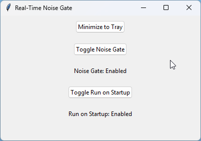

# Real-Time Noise Gate GUI

**Description**: A Real-Time Noise Gate GUI that filters out popping sounds when Realtek audio is idle on Windows 11.



## Tray Icon and Right-Click Options

Below is a screenshot of the app minimized to the system tray and the available right-click options:


## Features
- Real-time processing to eliminate audio pops
- User-friendly GUI with toggle options
- Minimize to tray functionality
- Option to run on startup

## Installation
1. Clone the repository:
   ```sh
   git clone https://github.com/ConceptExplorer/Realtime_Noise_Gate_GUI.git

## Important Notice

### Platform Support
This project is designed and tested specifically for Windows 11. At this time, Linux downloads are **unsupported**. The issues addressed in this project are specific to the Windows 11 operating system.

### Installation Instructions (Windows 11 Only)
1. Ensure you have Python 3.13.2 installed.
2. Uninstall any Python versions installed from the Microsoft Store.
3. Install the correct version of Python from [python.org](https://www.python.org/downloads/).
4. Follow the provided instructions to set up the environment and create the executable.

### Known Issues
- The current version of the script includes Windows-specific commands that may not function correctly on Linux or other operating systems.

Thank you for your understanding!
